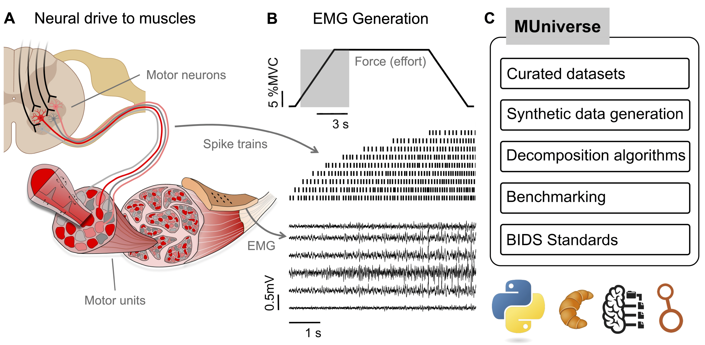

# MUniverse: Benchmarking Motor Unit Decomposition Algorithms

[](https://www.gnu.org/licenses/gpl-3.0)
[](https://www.python.org/downloads/)
[](https://dfarinagroup.github.io/muniverse/)

MUniverse is a modular framework for **simulated and experimental EMG dataset generation**, **motor unit decomposition algorithm benchmarking**, and **performance evaluation**. It integrates biomechanical simulation (via *NeuroMotion*), generative models (*BioMime*), standardized formats (e.g. BIDS/Croissant), and FAIR data hosting (Harvard Dataverse).

<p align="center">
  
</p>

## Features

- 🔬 **Algorithm Benchmarking**: Compare multiple motor unit decomposition algorithms (CBSS, SCD, Upperbound, AE)
- 📊 **Dataset Generation**: Generate simulated EMG datasets using NeuroMotion and experimental datasets
- 📁 **FAIR Data**: Access datasets through Harvard Dataverse with BIDS and Croissant format support
- 🔧 **Containerized Workflows**: Docker and Singularity support for reproducible algorithm execution
- 📈 **Performance Evaluation**: Comprehensive evaluation metrics and report card generation
- 📓 **Tutorial Notebooks**: Interactive Jupyter notebooks for dataset loading and algorithm usage

## Installation

### Requirements

- Python 3.11 or higher
- pip

### Package Installation

MUniverse is distributed as a Python package. To set up the development environment:

1. **Clone the repository:**
```bash
git clone https://github.com/dfarinagroup/muniverse.git
cd muniverse
```

2. **Create and activate a virtual environment:**
```bash
python -m venv .venv
source .venv/bin/activate  # On Windows: .venv\Scripts\activate
```

3. **Install the package:**
```bash
# Install core dependencies
pip install -e .

# Install development dependencies (optional)
pip install -e ".[dev]"
```

### Docker/Singularity Containers

For algorithm execution, Docker or Singularity containers are available. See the `docker/` directory for container definitions.

## Quick Start

### Loading a Dataset

```python
from muniverse.datasets import load_dataset

# Load a dataset from Harvard Dataverse
dataset = load_dataset("neuromotion-test", output_dir="./data")
```

### Running Decomposition

```python
from muniverse.algorithms import decompose_recording

# Run decomposition using CBSS algorithm
results, metadata = decompose_recording(
    data="path/to/emg_data.edf",
    method="cbss"
)

# Or use SCD algorithm (requires container)
results, metadata = decompose_recording(
    data="path/to/emg_data.edf",
    method="scd",
    container="path/to/muniverse_scd.sif",
    engine="singularity"
)
```

## Available Datasets

All datasets are hosted on [Harvard Dataverse](https://dataverse.harvard.edu/dataverse/muniverse-datasets) and follow FAIR principles:

- **Caillet et al. 2023** - [DOI: 10.7910/DVN/F9GWIW](https://doi.org/10.7910/DVN/F9GWIW)
- **Avrillon et al. 2024** - [DOI: 10.7910/DVN/L9OQY7](https://doi.org/10.7910/DVN/L9OQY7)
- **Grison et al. 2025** - [DOI: 10.7910/DVN/ID1WNQ](https://doi.org/10.7910/DVN/ID1WNQ)
- **Neuromotion-Train** - [DOI: 10.7910/DVN/2UQHTP](https://doi.org/10.7910/DVN/2UQHTP)
- **Neuromotion-Test** - [DOI: 10.7910/DVN/QYI336](https://doi.org/10.7910/DVN/QYI336)
- **Hybrid-Tibialis** - [DOI: 10.7910/DVN/YHTGGA](https://doi.org/10.7910/DVN/YHTGGA)

## Supported Algorithms

- **CBSS** - Convolutional Blind Source Separation
- **SCD** - Swarm Contrastive Decomposition ([GitHub](https://github.com/AgneGris/swarm-contrastive-decomposition))
- **Upperbound** - Upper bound performance estimation
- **AE** - Autoencoder-based decomposition

## Documentation (coming soon 🚧)

- 📖 [GitHub Pages Site](https://dfarinagroup.github.io/muniverse/) - Project documentation and overview
- 📓 [Tutorial Notebooks](notebooks/) - Interactive examples and guides
- 💻 [Source Code](https://github.com/dfarinagroup/muniverse) - Repository and issue tracking
- 📊 [Harvard Dataverse](https://dataverse.harvard.edu/dataverse/muniverse-datasets) - Dataset access and metadata

## Project Structure

```
muniverse/
├── src/                    # Package source code
│   └── muniverse/
│       ├── datasets/       # Dataset loading utilities
│       ├── algorithms/     # Decomposition algorithms
│       ├── data_generation/# Data generation utilities
│       ├── evaluation/     # Performance evaluation
│       └── utils/          # Utility functions
├── notebooks/              # Tutorial notebooks
├── scripts/                # Utility scripts
├── configs/                # Algorithm and dataset configurations
├── docker/                 # Docker container definitions
├── docs/                   # GitHub Pages documentation
├── tests/                  # Unit tests
├── pyproject.toml          # Package configuration
└── README.md               
```

## Contributing

Contributions are welcome! Please feel free to submit a Pull Request. For major changes, please open an issue first to discuss what you would like to change.

1. Fork the repository
2. Create a feature branch (`git checkout -b feature/amazing-feature`)
3. Commit your changes (`git commit -m 'Add some amazing feature'`)
4. Push to the branch (`git push origin feature/amazing-feature`)
5. Open a Pull Request

## Acknowledgments

- **NeuroMotion** - Biomechanical simulation framework ([GitHub](https://github.com/shihan-ma/NeuroMotion))
- **Swarm-Contrastive-Decomposition** - Decomposition algorithm ([GitHub](https://github.com/AgneGris/swarm-contrastive-decomposition))
- **Harvard Dataverse** - FAIR data hosting platform
- **BIDS** - Brain Imaging Data Structure standard
- **Croissant** - ML dataset metadata format

## Citation

If you use MUniverse in your research, please cite:

```bibtex
@inproceedings{
mamidanna2025muniverse,
title={{MU}niverse: A Simulation and Benchmarking Suite for Motor Unit Decomposition},
author={Pranav Mamidanna and Thomas Klotz and Dimitrios Halatsis and Agnese Grison and Irene Mendez Guerra and Shihan Ma and Arnault H. Caillet and Simon Avrillon and Robin Rohl{\'e}n and Dario Farina},
booktitle={The Thirty-ninth Annual Conference on Neural Information Processing Systems Datasets and Benchmarks Track},
year={2025},
url={https://openreview.net/forum?id=Slrp3l7aYo}
}
```

### Contact

For questions, issues, or contributions, please:
- Open an issue on [GitHub](https://github.com/dfarinagroup/muniverse/issues)
- Contact the maintainers via email (see `pyproject.toml` for author emails)

### License

MUniverse is licensed under the **GNU General Public License v3.0** (GPL-3.0).

**Important Licensing Notes:**
- This project uses **NeuroMotion**, which is licensed under GNU GPL v3.0. As a result, MUniverse is also licensed under GNU GPL v3.0 to comply with the copyleft requirements of the GPL license.
- This project also integrates with **Swarm-Contrastive-Decomposition**, which is licensed under Creative Commons Attribution-NonCommercial 4.0 International Public License.

See the [LICENSE](LICENSE) file for full details.
